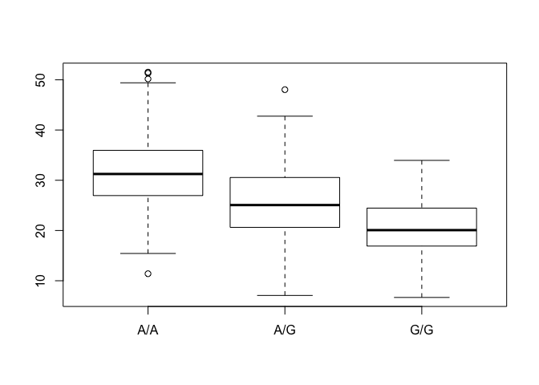

Class 14
================

Asthma SNPs in MXL Population
-----------------------------

``` r
#read file from Ensemble
mxl <- read.csv("373531-SampleGenotypes-Homo_sapiens_Variation_Sample_rs8067378.csv")
head(mxl)
```

    ##   Sample..Male.Female.Unknown. Genotype..forward.strand. Population.s.
    ## 1                  NA19648 (F)                       A|A ALL, AMR, MXL
    ## 2                  NA19649 (M)                       G|G ALL, AMR, MXL
    ## 3                  NA19651 (F)                       A|A ALL, AMR, MXL
    ## 4                  NA19652 (M)                       G|G ALL, AMR, MXL
    ## 5                  NA19654 (F)                       G|G ALL, AMR, MXL
    ## 6                  NA19655 (M)                       A|G ALL, AMR, MXL
    ##   Father Mother
    ## 1      -      -
    ## 2      -      -
    ## 3      -      -
    ## 4      -      -
    ## 5      -      -
    ## 6      -      -

``` r
mxl$Genotype..forward.strand.
```

    ##  [1] A|A G|G A|A G|G G|G A|G A|G A|A A|G A|A G|A A|A A|A G|G A|A A|G A|G
    ## [18] A|G A|G G|A A|G G|G G|G G|A G|G A|G A|A A|A A|G A|A A|G G|A G|G A|A
    ## [35] A|A A|A G|A A|G A|G A|G A|A G|A A|G G|A G|A A|A A|A A|G A|A A|A A|G
    ## [52] A|G A|A G|A A|A G|A A|G A|A G|A A|G G|G A|A G|A A|G
    ## Levels: A|A A|G G|A G|G

How many G|G genotypes?

``` r
table(mxl$Genotype..forward.strand.)
```

    ## 
    ## A|A A|G G|A G|G 
    ##  22  21  12   9

or

``` r
GG <- sum(mxl$Genotype..forward.strand. == "G|G")
GG
```

    ## [1] 9

``` r
# %GG
total.genotypes <- sum(table(mxl$Genotype..forward.strand.))
GG/total.genotypes *100
```

    ## [1] 14.0625

RNA-Seq
=======

Fastq quality scores

Does the first sequence have good quality?

``` r
#install.packages("seqinr")
library(seqinr)

#install.packages("gtools")
library(gtools)

#interpret
q <- "D D D D C D E D C D D D D B B D D D C C @ "
asc(s2c(q)) -33
```

    ##  D     D     D     D     C     D     E     D     C     D     D     D     D 
    ## 35 -1 35 -1 35 -1 35 -1 34 -1 35 -1 36 -1 35 -1 34 -1 35 -1 35 -1 35 -1 35 
    ##     B     B     D     D     D     C     C     @    
    ## -1 33 -1 33 -1 35 -1 35 -1 35 -1 34 -1 34 -1 31 -1

Population scale analysis
=========================

Does the genotype for rs8067378 influence expression of the important asthma linked genes we found?

``` r
geno <- read.table("rs8067378_ENSG00000172057.6.txt")
head(geno)
```

    ##    sample geno      exp
    ## 1 HG00367  A/G 28.96038
    ## 2 NA20768  A/G 20.24449
    ## 3 HG00361  A/A 31.32628
    ## 4 HG00135  A/A 34.11169
    ## 5 NA18870  G/G 18.25141
    ## 6 NA11993  A/A 32.89721

``` r
table(geno$geno)
```

    ## 
    ## A/A A/G G/G 
    ## 108 233 121

``` r
inds.gg <- geno$geno == "G/G"
summary( geno$exp[inds.gg])
```

    ##    Min. 1st Qu.  Median    Mean 3rd Qu.    Max. 
    ##   6.675  16.903  20.074  20.594  24.457  33.956

``` r
inds.aa <- geno$geno == "A/A"
summary( geno$exp[inds.aa])
```

    ##    Min. 1st Qu.  Median    Mean 3rd Qu.    Max. 
    ##   11.40   27.02   31.25   31.82   35.92   51.52

``` r
inds.ag <- geno$geno == "A/G"
summary( geno$exp[inds.ag])
```

    ##    Min. 1st Qu.  Median    Mean 3rd Qu.    Max. 
    ##   7.075  20.626  25.065  25.397  30.552  48.034

Figure showing distribution of these expression values

``` r
boxplot(exp ~ geno, geno)
```


