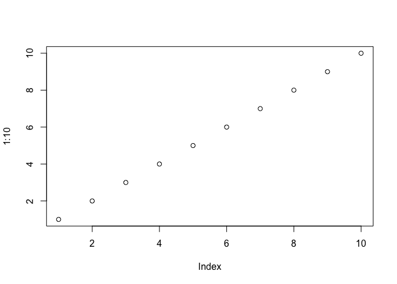
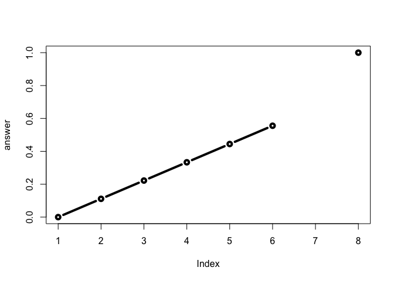
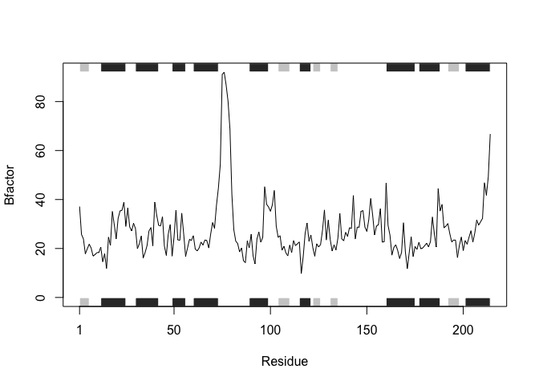

Class 6
================
Nasha Luevit
January 24, 2019

Section 1: Reading files again
------------------------------

Here we are going to try using the **read.table()** function and friends to read some example flat files (text files)

``` r
plot(1:10)
```



Back to file reading (option+command+i will start new code)

``` r
read.table("https://bioboot.github.io/bimm143_W19/class-material/test1.txt", header = TRUE, sep = ",")
```

    ##   Col1 Col2 Col3
    ## 1    1    2    3
    ## 2    4    5    6
    ## 3    7    8    9
    ## 4    a    b    c

For this common CSV format we can use **read.csv()**

``` r
file1 <- "https://bioboot.github.io/bimm143_W19/class-material/test1.txt"
data1 <- read.csv(file1) 
data1
```

    ##   Col1 Col2 Col3
    ## 1    1    2    3
    ## 2    4    5    6
    ## 3    7    8    9
    ## 4    a    b    c

Practice reading files

``` r
file2 <- "https://bioboot.github.io/bimm143_W19/class-material/test2.txt"
data2 <- read.csv(file2, sep = "$")
data2
```

    ##   Col1 Col2 Col3
    ## 1    1    2    3
    ## 2    4    5    6
    ## 3    7    8    9
    ## 4    a    b    c

``` r
file3 <- "https://bioboot.github.io/bimm143_W19/class-material/test3.txt"
data3 <- read.table(file3)
data3
```

    ##   V1 V2 V3
    ## 1  1  6  a
    ## 2  2  7  b
    ## 3  3  8  c
    ## 4  4  9  d
    ## 5  5 10  e

Section 2: R Functions
----------------------

My first silly function

``` r
add <- function(x, y=1) {
  #sum the input x and y
  x + y
}
```

Try using the function

``` r
add(1)
```

    ## [1] 2

``` r
add(1,100)
```

    ## [1] 101

``` r
add( c(1,2,3), 4)
```

    ## [1] 5 6 7

``` r
#add(1,2,2)
#(too many arguments -> returns error)
```

``` r
#add(x=1, y="b")
#(arguments don't match)
```

My 2nd Function

``` r
rescale <- function(x) {
 rng <-range(x)
 (x - rng[1]) / (rng[2] - rng[1])
}
```

Test on a small example that we know the answer to

``` r
rescale(1:10)
```

    ##  [1] 0.0000000 0.1111111 0.2222222 0.3333333 0.4444444 0.5555556 0.6666667
    ##  [8] 0.7777778 0.8888889 1.0000000

``` r
rescale( c(1,2,NA,3,10) )
```

    ## [1] NA NA NA NA NA

``` r
#rescale( c(1,10,"string") )
#doesn't work
```

modify function

``` r
rescale2 <- function(x) {
 rng <-range(x, na.rm = TRUE)
 (x - rng[1]) / (rng[2] - rng[1])
}
```

test modified function

``` r
rescale2( c(1,2,NA, 3, 10) )
```

    ## [1] 0.0000000 0.1111111        NA 0.2222222 1.0000000

new function

``` r
rescale3 <- function(x, na.rm=TRUE, plot=FALSE) {
 rng <-range(x, na.rm=na.rm)
 print("Hello")
 answer <- (x - rng[1]) / (rng[2] - rng[1])
 print("is it me you are looking for?")
 if(plot) {
 plot(answer, typ="b", lwd=4)
   print("please dont sing anymore barry!")
 }
 print("I can see it in ...")
 return(answer)
}
```

test new function

``` r
myans <- rescale3( c(1:6, NA, 10), plot=TRUE )
```

    ## [1] "Hello"
    ## [1] "is it me you are looking for?"



    ## [1] "please dont sing anymore barry!"
    ## [1] "I can see it in ..."

modify

``` r
rescale4 <- function(x, na.rm=TRUE, plot=TRUE) {
 rng <-range(x, na.rm=na.rm)
 print("Hello")
 answer <- (x - rng[1]) / (rng[2] - rng[1])
 print("is it me you are looking for?")
 if(plot) {
 plot(answer, typ="b", lwd=4)
   print("please don't ever sing again!")
 }
 print("I can see it in ...")
 return(answer)
}
```

test

``` r
rescale4( c(1:6, NA,10) )
```

    ## [1] "Hello"
    ## [1] "is it me you are looking for?"


    ## [1] "please don't ever sing again!"
    ## [1] "I can see it in ..."

    ## [1] 0.0000000 0.1111111 0.2222222 0.3333333 0.4444444 0.5555556        NA
    ## [8] 1.0000000

Working with the bio3d package
------------------------------

to install this package, command **install.packages("bio3d")** was used

using package

``` r
library(bio3d)
```

``` r
# read a PDB file from the database
s1 <- read.pdb("4AKE") # kinase with drug
```

    ##   Note: Accessing on-line PDB file

``` r
s1
```

    ## 
    ##  Call:  read.pdb(file = "4AKE")
    ## 
    ##    Total Models#: 1
    ##      Total Atoms#: 3459,  XYZs#: 10377  Chains#: 2  (values: A B)
    ## 
    ##      Protein Atoms#: 3312  (residues/Calpha atoms#: 428)
    ##      Nucleic acid Atoms#: 0  (residues/phosphate atoms#: 0)
    ## 
    ##      Non-protein/nucleic Atoms#: 147  (residues: 147)
    ##      Non-protein/nucleic resid values: [ HOH (147) ]
    ## 
    ##    Protein sequence:
    ##       MRIILLGAPGAGKGTQAQFIMEKYGIPQISTGDMLRAAVKSGSELGKQAKDIMDAGKLVT
    ##       DELVIALVKERIAQEDCRNGFLLDGFPRTIPQADAMKEAGINVDYVLEFDVPDELIVDRI
    ##       VGRRVHAPSGRVYHVKFNPPKVEGKDDVTGEELTTRKDDQEETVRKRLVEYHQMTAPLIG
    ##       YYSKEAEAGNTKYAKVDGTKPVAEVRADLEKILGMRIILLGAPGA...<cut>...KILG
    ## 
    ## + attr: atom, xyz, seqres, helix, sheet,
    ##         calpha, remark, call

Try out provided code

``` r
s1 <- read.pdb("4AKE") # kinase with drug
```

    ##   Note: Accessing on-line PDB file

    ## Warning in get.pdb(file, path = tempdir(), verbose = FALSE): /var/folders/
    ## 35/q8hvp9h51w997frvf83ml_8w0000gn/T//RtmpJoeWSj/4AKE.pdb exists. Skipping
    ## download

``` r
s2 <- read.pdb("1AKE") # kinase no drug
```

    ##   Note: Accessing on-line PDB file
    ##    PDB has ALT records, taking A only, rm.alt=TRUE

``` r
s3 <- read.pdb("1E4Y") # kinase with drug
```

    ##   Note: Accessing on-line PDB file

``` r
s1.chainA <- trim.pdb(s1, chain="A", elety="CA")
s2.chainA <- trim.pdb(s2, chain="A", elety="CA")
s3.chainA <- trim.pdb(s3, chain="A", elety="CA")

s1.b <- s1.chainA$atom$b
s2.b <- s2.chainA$atom$b
s3.b <- s3.chainA$atom$b

plotb3(s1.b, sse=s1.chainA, typ="l", ylab="Bfactor")
```


``` r
plotb3(s2.b, sse=s2.chainA, typ="l", ylab="Bfactor")
```



``` r
plotb3(s3.b, sse=s3.chainA, typ="l", ylab="Bfactor")
```


